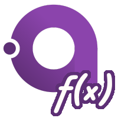
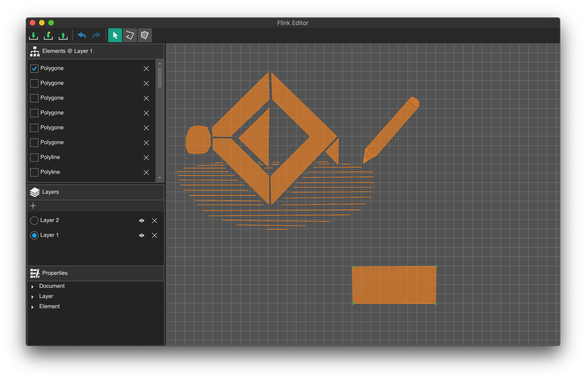

# Avalonia.FuncUI

[](https://voyonic-labs.visualstudio.com/Avalonia.FuncUI/_build/latest?definitionId=10&branchName=master)

Develop cross-plattform MVU GUI Applications using F# and Avalonia!

> A new major version is currently in development. Most problems that are inherited from the current architecture will be addressed. There will be breaking changes. It is basically a rewrite to get things right from the ground up. This also means there will be new features such as 📣 subscribable properties, a better discoverable DSL, even more strongly typed views and more to come.


*(Application was created using Avalonia.FuncUI!)*

## About
This library allows you to write cross-plattform GUI Applications entirely in F# - No XAML, but a declarative elm like DSL. MVU (Model-View-Update) architecture support is built in, and bindings to use it with Elmish are also ready to use.

## Getting started
Check out the [Wiki](https://github.com/JaggerJo/Avalonia.FuncUI/wiki) (WIP) and [Examples](https://github.com/JaggerJo/Avalonia.FuncUI/tree/master/src/Examples).

### 🧱 Templates

**Install the templates [nuget](https://www.nuget.org/packages/JaggerJo.Avalonia.FuncUI.Templates/) / [fuget](https://www.fuget.org/packages/JaggerJo.Avalonia.FuncUI.Templates/)**
```
dotnet new -i JaggerJo.Avalonia.FuncUI.Templates
```
**Create new app**
```
dotnet new avalonia-funcUI-basic -n NewApp
```

### 📦 Packages

**Avalonia.FuncUI [nuget](https://www.nuget.org/packages/JaggerJo.Avalonia.FuncUI/) / [fuget](https://www.fuget.org/packages/JaggerJo.Avalonia.FuncUI/)**
```
Install-Package JaggerJo.Avalonia.FuncUI
```

**Avalonia.FuncUI.Elmish [nuget](https://www.nuget.org/packages/JaggerJo.Avalonia.FuncUI.Elmish/) /  [fuget](https://www.fuget.org/packages/JaggerJo.Avalonia.FuncUI.Elmish/)**
```
Install-Package JaggerJo.Avalonia.FuncUI.Elmish
```

## Current State
Should be usable, API is stable-ish (expect some minor changes).

## Contributing
Please contribute to this library through issue reports, pull requests, code reviews and discussion.

## Example
Below is the code of a simple counter app (using the Avalonia.FuncUI.Elmish package).

```f#
module Counter =

    type CounterState = {
        count : int
    }

    let init = {
        count = 0
    }

    type Msg =
    | Increment
    | Decrement

    let update (msg: Msg) (state: CounterState) : CounterState =
        match msg with
        | Increment -> { state with count =  state.count + 1 }
        | Decrement -> { state with count =  state.count - 1 }
    
    let view (state: CounterState) (dispatch): View =
        Views.dockPanel [
            Attrs.children [
                Views.button [
                    Attrs.click (fun sender args -> dispatch Increment)
                    Attrs.content "click to increment"
                ]
                Views.button [
                    Attrs.click (fun sender args -> dispatch Decrement)
                    Attrs.content "click to decrement" 
                ]
                Views.textBlock [
                    Attrs.dockPanel_dock Dock.Top
                    Attrs.text (sprintf "the count is %i" state.count)
                ]
            ]
        ]    
```
