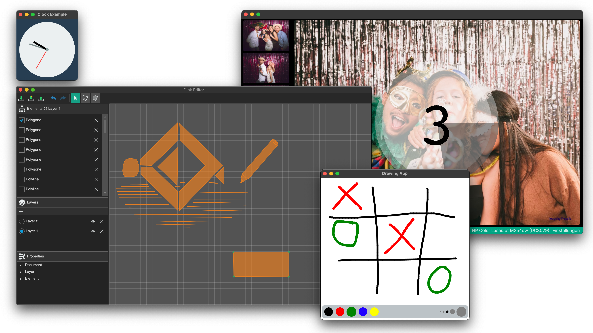

[](https://vshymanskyy.github.io/StandWithUkraine)

<h1 align="center"> 
Avalonia FuncUI
</h1>

<p align="center">Develop cross-platform GUI Applications using <a href="https://fsharp.org">F#<a> and <a href="https://github.com/AvaloniaUI/Avalonia">AvaloniaUI</a>!</p>
<p align="center">


<a href="https://www.nuget.org/packages/Avalonia.FuncUI">
  
</a>
</p><br>



## About
FuncUI is a thin layer built on top of [AvaloniaUI](https://github.com/AvaloniaUI/Avalonia). It contains abstractions 
for writing UI applications in different programming styles. It also contains a component & state management system. 

FuncUI mostly consists of:
- Virtual DOM
- View DSL
- Component model

## Resources

- 💨 [Getting started](https://funcui.avaloniaui.net)

- 📚 [Documentation](https://funcui.avaloniaui.net/)

- 📓 [Examples](https://github.com/fsprojects/Avalonia.FuncUI/tree/master/src/Examples)

## Contributing
Please contribute to this library through issue reports, pull requests, code reviews, documentation, and discussion. 

## Examples
### Example using components
A simple counter made with the component library:

``` f#
type Components =
    static member Counter () =
        Component (fun ctx ->
            let state = ctx.useState 0
    
            DockPanel.create [
                DockPanel.children [
                    Button.create [
                        Button.onClick (fun _ -> state.Set(state.Current - 1))
                        Button.content "click to decrement"
                    ]
                    Button.create [
                        Button.onClick (fun _ -> state.Set(state.Current + 1))
                        Button.content "click to increment"
                    ]
                    TextBlock.create [
                        TextBlock.dock Dock.Top
                        TextBlock.text (string state.Current)
                    ]
                ]
            ]
        )
```

Find more examples using components in the [Components Examples folder](https://github.com/fsprojects/Avalonia.FuncUI/tree/master/docs/components).

### Example using Elmish
The same counter as above but using the `Avalonia.FuncUI.Elmish` package:

```f#
module Counter =
    type CounterState = { count : int }
    let init = { count = 0 }
    type Msg = Increment | Decrement

    let update (msg: Msg) (state: CounterState) : CounterState =
        match msg with
        | Increment -> { state with count =  state.count + 1 }
        | Decrement -> { state with count =  state.count - 1 }
    
    let view (state: CounterState) (dispatch): IView =
        DockPanel.create [
            DockPanel.children [
                Button.create [
                    Button.onClick (fun _ -> dispatch Increment)
                    Button.content "click to increment"
                ]
                Button.create [
                    Button.onClick (fun _ -> dispatch Decrement)
                    Button.content "click to decrement" 
                ]
                TextBlock.create [
                    TextBlock.dock Dock.Top
                    TextBlock.text (sprintf "the count is %i" state.count)
                ]
            ]
        ]    
```

Find more examples using Elmish in the [Elmish Examples folder](https://github.com/fsprojects/Avalonia.FuncUI/tree/master/src/Examples/Elmish)

# Maintainer(s)

The current co-maintainers of Avalonia.FuncUI are

* @Numpsy
* @JordanMarr
* @sleepyfran
* @JaggerJo (project originator)

The default maintainer account for projects under "fsprojects" is @fsprojectsgit - F# Community Project Incubation Space (repo management)

# Commercial Support
**Provided by [Voynoic Systems GmbH](https://www.voyonic-systems.de)**

Please reach out to contact@voyonic-systmes.de if you need a commercial support contract or are interested in contract work.

# Star History 

<a href="https://star-history.com/#fsprojects/Avalonia.FuncUI&Date">
  <picture>
    <source media="(prefers-color-scheme: dark)" srcset="https://api.star-history.com/svg?repos=fsprojects/Avalonia.FuncUI&type=Date&theme=dark" />
    <source media="(prefers-color-scheme: light)" srcset="https://api.star-history.com/svg?repos=fsprojects/Avalonia.FuncUI&type=Date" />
    
  </picture>
</a>


