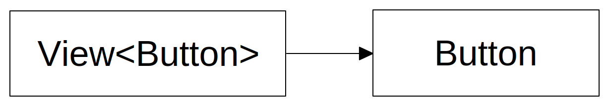

# Lifetime

Every FuncUI view is backed by an Avalonia Control. Even when attributes of a view change, the backing control does not change. Instead, changes are mirrored to the backing Control. This is often called "patching".



Views don't hold a reference to their backing Avalonia control. The backing control is determined by the view structure.&#x20;


This means if the structure changes the backing control also does change. FuncUI will ensure the new backing control is patched / has all attributes set as specified in the view.

If the view type in the structure does not match the view type in the backing structure a new backing control is created.



Only backing views of the same type can be reused when the view structure changes.


## Keyed Views

Sometimes you need more control over the reuse of backing controls. This can be achieved by specifying a view key.\
\
If the view key changes a new backing view is created, no patching is attempted.&#x20;

```fsharp
[ 
    // View attributes
]
|> Button.create
|> View.withKey "button-1"
```

```fsharp
View.createWithKey "button-1" Button.create [
    // View attributes
]
```
