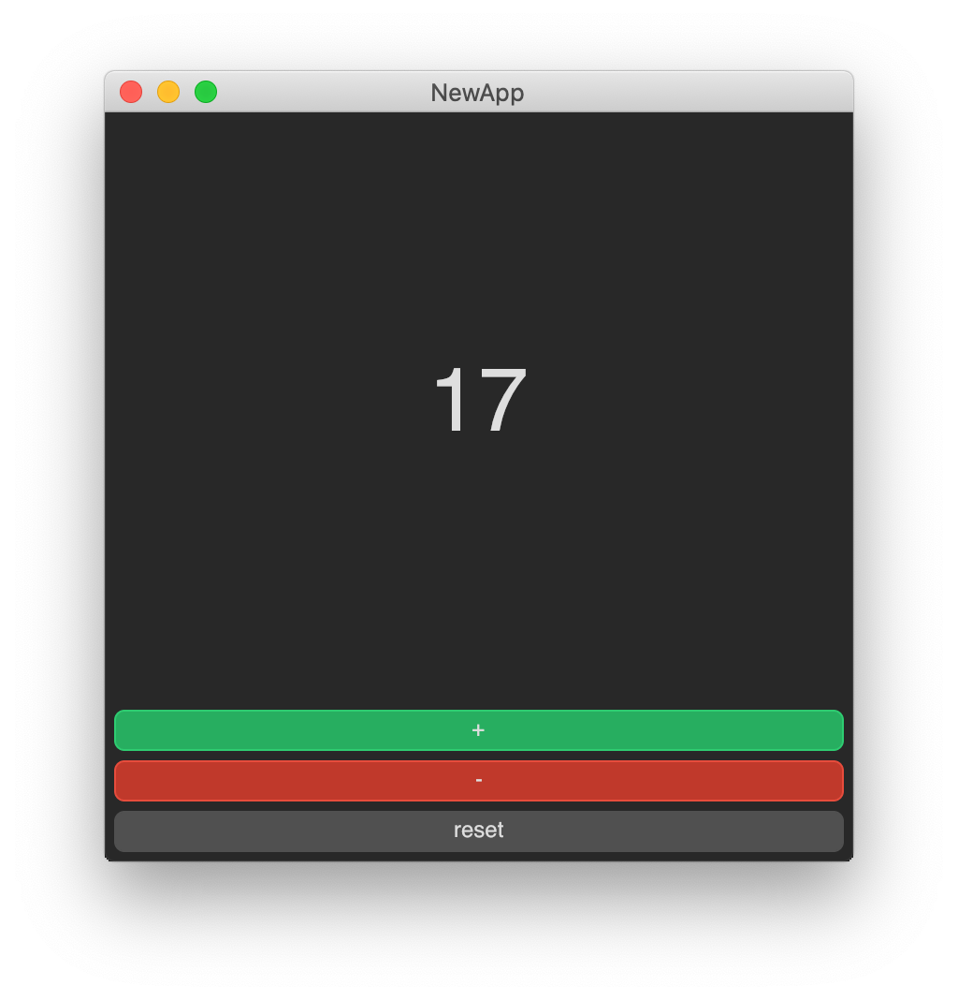

# Avalonia FuncUI ProjectTemplates

This project contains .NET Project templates for FuncUI, both for Component and Elmish projects.

## Install

```
dotnet new --install Avalonia.FuncUI.Templates
```

## Create an App

We currently offer templates for both Component projects and Elmish projects. If you are not sure what to choose
you can take a look at the [documentation](../../README.md) or the [examples](../Examples) to help you decide.

### Using components

### Create a new basic App

This template only contains a simple view and no extra resources that serve as a starting point if you are only creating
a basic app.

```
dotnet new funcui.basic -n NewApp
```

### Create a new full App

This template contains a more complex example with a `Style.xaml` file and other extras that you can find on more elaborate
applications.

```
dotnet new funcui.full -n NewApp
```

### Using Elmish

### Create a new basic App

This template only contains a simple view and no extra resources that serve as a starting point if you are only creating
a basic app.

```
dotnet new funcui.basic.mvu -n NewApp
```

### Create a new full App

This template contains a more complex example with a `Style.xaml` file and other extras that you can find on more elaborate
applications.

```
dotnet new funcui.full.mvu -n NewApp
```

### Create a new cross platform App

This template contains a cross platform example with a `Style.xaml` file and other extras that you can find on more elaborate
applications. Unlike other templates only for desktop, this template also targets iOS, Android and Browser through WebAsembly.

```
dotnet new funcui.xplat -n NewApp
```

Additional options include

```
  -f, --framework <net7.0>                      The target framework for the solution.
                                                Type: choice
                                                  net7.0  Target net7.0
                                                Default: net7.0
  -p, --platform <Android|Browser|Desktop|iOS>  The target platforms for the solution.
                                                Type: choice
                                                  Desktop  Desktop: Windows/Linux/MacOS
                                                  iOS      Mobile: iOS
                                                  Android  Mobile: Android
                                                  Browser  Browser: WebAssembly
                                                Multiple values are allowed: True
                                                Default: Desktop|iOS|Android|Browser
  -id <id>                                      The application ID for mobile projects (ApplicationId MSBuild property).
                                                Type: string
                                                Default: com.companyname.AvaloniaFuncUIApplication
  -vn, --version <version>                      The application version for desktop and mobile projects (ApplicationVersion MSBuild property). Required to be integer on mobile projects and <=10000 on iOS. Must be incremented per store submission.
                                                Type: integer
                                                Default: 1
  -vd, --display-version <display-version>      The application display version for desktop and mobile projects (ApplicationDisplayVersion MSBuild property).
                                                Type: string
                                                Default: 1.0-funcui
  -t, --title <title>                           The application title for desktop and mobile projects (ApplicationTitle MSBuild property).
                                                Type: string
                                                Default: Avalonia FuncUI Application

```

## Run the App

All templates in both Components and Elmish flavors should create the same result:

```
dotnet run
```


